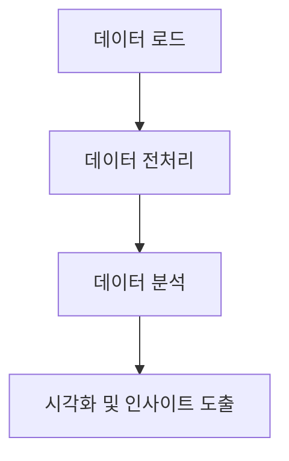

# bigdata-lesson

## 소개

게임 '리그오브레전드'의 플레이 가능한 오브젝트인 '챔피언'들에 대하여 데이터 분석을 실행한 streamlit 프로젝트입니다.

## 주제 선택 이유

자주 하던 게임의 자주 방문하던 사이트인 op.gg가 내부적으로 어떤 식으로 돌아가는지 간접체험 해보기 위해서 진행했습니다.

## 데이터셋
https://www.kaggle.com/datasets/nathansmallcalder/lol-match-history-and-summoner-data-80k-matches?select=SummonerMatchTbl.csv

**ChampionTbl**
|ChampionId|ChampionName|
|----------|------------|
|0         |No Champion |
|1         |Annie       |
|2         |Olaf        |
|3         |Galio       |
|4         |TwistedFate |
|5         |XinZhao     |
|6         |Urgot       |
|7         |Leblanc     |
|8         |Vladimir    |
|9         |Fiddlesticks|
|10        |Kayle       |

**ItemTbl**
|ItemID|ItemName    |
|------|------------|
|1001  |Boots       |
|1004  |Faerie Charm|
|1006  |Rejuvenation Bead|
|1011  |Giant's Belt|
|1018  |Cloak of Agility|
|1026  |Blasting Wand|
|1027  |Sapphire Crystal|
|1028  |Ruby Crystal|
|1029  |Cloth Armor |
|1031  |Chain Vest  |
|1033  |Null-Magic Mantle|

**MatchStatsTbl**
|MatchStatsId|SummonerMatchFk|MinionsKilled|DmgDealt|DmgTaken|TurretDmgDealt|TotalGold|Lane   |Win|item1 |item2 |item3 |item4 |item5 |item6 |kills|deaths|assists|PrimaryKeyStone|PrimarySlot1|PrimarySlot2|PrimarySlot3|SecondarySlot1|SecondarySlot2|SummonerSpell1|SummonerSpell2|CurrentMasteryPoints|EnemyChampionFk|DragonKills|BaronKills|visionScore|
|------------|---------------|-------------|--------|--------|--------------|---------|-------|---|------|------|------|------|------|------|-----|------|-------|---------------|------------|------------|------------|--------------|--------------|--------------|--------------|--------------------|---------------|-----------|----------|-----------|
|1           |1              |30           |4765    |12541   |0             |7058     |BOTTOM |0  |3870  |2055  |3107  |3171  |6620  |2022  |0    |2     |12     |8465           |8463        |8473        |8453        |8345          |8347          |4             |7             |902                 |51             |0          |0         |67         |
|2           |2              |29           |8821    |14534   |1             |9618     |BOTTOM |0  |3870  |2065  |3107  |3158  |6620  |3916  |2    |5     |23     |8465           |8463        |8473        |8453        |8345          |8347          |4             |7             |902                 |236            |0          |0         |88         |
|3           |3              |34           |6410    |19011   |3             |9877     |BOTTOM |1  |3870  |3107  |1011  |3171  |6617  |3916  |0    |5     |22     |8214           |8226        |8210        |8237        |8345          |8347          |4             |7             |16                  |498            |0          |0         |97         |
|4           |4              |51           |22206   |14771   |3             |12374    |NONE   |1  |6655  |3089  |4645  |3020  |0     |0     |8    |4     |35     |8112           |8143        |8140        |8106        |8226          |8210          |4             |14            |103                 |54             |0          |0         |0          |
|5           |5              |0            |39106   |33572   |0             |15012    |TOP    |1  |4015  |223157|226653|222503|223089|447108|13   |8     |2      |0              |0           |0           |0           |0             |0             |2202          |2201          |800                 |12             |0          |0         |0          |
|6           |6              |0            |30259   |21355   |0             |12000    |TOP    |1  |223112|223157|447108|223020|223089|444644|6    |6     |4      |0              |0           |0           |0           |0             |0             |2202          |2201          |127                 |516            |0          |0         |0          |
|7           |7              |28           |3775    |12061   |0             |6344     |BOTTOM |0  |3870  |2055  |6620  |3158  |3916  |3067  |0    |1     |7      |8214           |8226        |8210        |8237        |8345          |8347          |4             |7             |902                 |523            |0          |0         |60         |
|8           |8              |36           |4217    |13464   |0             |7403     |BOTTOM |0  |3870  |2065  |0     |3158  |4005  |0     |1    |5     |6      |8214           |8226        |8210        |8237        |8345          |8347          |4             |7             |267                 |81             |0          |0         |55         |
|9           |9              |31           |10255   |19432   |1             |11905    |BOTTOM |1  |3870  |3107  |2065  |3158  |6620  |3916  |2    |2     |30     |8214           |8226        |8210        |8237        |8345          |8347          |4             |7             |902                 |15             |0          |0         |83         |
|10          |10             |42           |51900   |32851   |2             |18209    |TOP    |1  |6655  |3157  |3020  |4646  |3089  |3145  |15   |10    |43     |8112           |8139        |8140        |8135        |8014          |9111          |4             |14            |7                   |29             |0          |0         |0          |

**MatchTbl**
|MatchId|Patch|QueueType|RankFk|GameDuration|
|-------|-----|---------|------|------------|
|EUW1_6681382047|13.22.541.9804|CLASSIC  |0     |1050        |
|EUW1_6681412019|13.22.541.9804|CLASSIC  |0     |778         |
|EUW1_6681445530|13.22.541.9804|ARAM     |0     |753         |
|EUW1_6681464371|13.22.541.9804|ARAM     |0     |853         |
|EUW1_6681718380|13.22.541.9804|ARAM     |0     |1226        |
|EUW1_6688366852|13.23.544.5515|ARAM     |0     |1001        |
|EUW1_6688385247|13.23.544.5515|CLASSIC  |0     |994         |
|EUW1_6688490074|13.23.544.5515|CLASSIC  |0     |1233        |
|EUW1_6694890554|13.23.544.5515|ARAM     |0     |1160        |
|EUW1_6760672344|14.1.552.7117|ARAM     |0     |1718        |
|EUW1_6796881027|14.2.556.3141|CLASSIC  |0     |1943        |
|EUW1_6796951453|14.2.556.3141|CLASSIC  |0     |1629        |
|EUW1_6797018353|14.2.556.3141|CLASSIC  |0     |1702        |
|EUW1_6797098869|14.2.556.3141|CLASSIC  |0     |1932        |
|EUW1_6808873078|14.3.558.8314|CLASSIC  |0     |1362        |
|EUW1_6808917452|14.3.558.8314|CLASSIC  |0     |1670        |

**RankTbl**
|RankId|RankName|
|------|--------|
|0     |Unranked|
|1     |Iron    |
|2     |Bronze  |
|3     |Silver  |
|4     |Gold    |
|5     |Platinum|
|6     |Emerald |
|7     |Diamond |
|8     |Master  |
|9     |Grandmaster|
|10    |Challenger|

**SummonerMatchTbl**
|SummonerMatchId|SummonerFk|MatchFk        |ChampionFk|
|---------------|----------|---------------|----------|
|1              |1         |EUW1_7565751492|902       |
|2              |1         |EUW1_7565549583|902       |
|3              |1         |EUW1_7564803077|16        |
|4              |1         |EUW1_7564368646|103       |
|5              |1         |EUW1_7564332041|800       |
|6              |1         |EUW1_7564297394|127       |
|7              |1         |EUW1_7564257986|902       |
|8              |1         |EUW1_7563685543|267       |
|9              |1         |EUW1_7563605642|902       |
|10             |1         |EUW1_7563553417|7         |

**TeamMatchTbl**
|TeamID|MatchFk|B1Champ        |B2Champ|B3Champ|B4Champ|B5Champ|R1Champ|R2Champ|R3Champ|R4Champ|R5Champ|BlueBaronKills|BlueRiftHeraldKills|BlueDragonKills|BlueTowerKills|BlueKills|RedBaronKills|RedRiftHeraldKills|RedDragonKills|RedTowerKills|RedKills|RedWin|BlueWin|
|------|-------|---------------|-------|-------|-------|-------|-------|-------|-------|-------|-------|--------------|-------------------|---------------|--------------|---------|-------------|------------------|--------------|-------------|--------|------|-------|
|1     |EUW1_7565751492|897            |154    |157    |51     |902    |164    |5      |25     |221    |497    |0             |1                  |1              |3             |13       |1            |0                 |3             |8            |26      |1     |0      |
|2     |EUW1_7565549583|82             |238    |157    |236    |89     |6      |254    |127    |42     |902    |1             |0                  |3              |10            |39       |0            |1                 |1             |3            |33      |0     |1      |
|3     |EUW1_7564803077|516            |28     |4      |498    |235    |23     |64     |38     |901    |16     |0             |1                  |2              |7             |27       |2            |0                 |3             |8            |37      |1     |0      |
|4     |EUW1_7564368646|54             |34     |59     |498    |103    |61     |25     |55     |106    |5      |0             |0                  |0              |4             |55       |0            |0                 |0             |0            |39      |0     |1      |
|5     |EUW1_7564332041|12             |800    |111    |150    |142    |141    |101    |55     |950    |4      |0             |0                  |0              |0             |42       |0            |0                 |0             |0            |0       |0     |1      |
|6     |EUW1_7564297394|45             |62     |516    |897    |555    |516    |80     |105    |30     |161    |0             |0                  |0              |0             |59       |0            |0                 |0             |0            |0       |0     |1      |
|7     |EUW1_7564257986|86             |245    |25     |523    |888    |10     |64     |3      |235    |902    |1             |1                  |3              |11            |24       |0            |0                 |1             |3            |7       |0     |1      |
|8     |EUW1_7563685543|69             |11     |150    |81     |201    |133    |245    |101    |119    |267    |1             |0                  |4              |9             |34       |0            |1                 |0             |2            |18      |0     |1      |
|9     |EUW1_7563605642|17             |102    |38     |15     |902    |516    |517    |25     |202    |53     |2             |0                  |2              |6             |45       |0            |1                 |4             |9            |36      |0     |1      |
|10    |EUW1_7563553417|29             |517    |38     |804    |22     |84     |895    |523    |777    |7      |0             |0                  |0              |2             |73       |0            |0                 |0             |4            |91      |1     |0      |

## 주요 기능
- **데이터셋 관리를 위한 dataset.py 모듈**  
dataset.py에 get_path(), get_dataset_by_id() 등을 선언해 원하는 데이터셋을 쉽게 불러올 수 있습니다.

- **챔피언의 세부 내용 검색**  
  여러가지 챔피언들의 stat(kills, deaths, assists, total_gold 등)들을 select 박스를 통해 선택하여 확인할 수 있습니다. Default는 모든 챔피언입니다. version 별로, 랭크 별로 검색도 할 수 있습니다. 10분 당 평균으로 계산됩니다.

- **챔피언 분석**  
  챔피언의 각종 정보를 취합하여 승률, 픽률, 주 라인 등을 통계 냅니다.

- **시각화**  
  각 통계들을 matplotlib 등을 이용하여 막대 그래프로 시각화합니다.

- **군집화**  
  k_means 군집화를 통해 각 챔피언들의 객관적인 성능을 1-5티어로 분류합니다.

### 데이터 분석 파이프라인

### 주요 폴더 및 파일 구조

- `notebooks/` : 실습용 Jupyter 노트북 파일
- `data/` : 실습 데이터 파일
- `src/` : 분석 및 처리용 Python 코드
- `src/utils` : 데이터셋 관리를 위한 유틸 코드 디렉토리
- `src/pages` : 페이지 관련 streamlit 코드 디렉토리
- `requirements.txt` : 필요한 라이브러리 명시
- `README.md` : 프로젝트 설명

---

### 시연 영상

https://youtu.be/SHtWjxzUSt4
